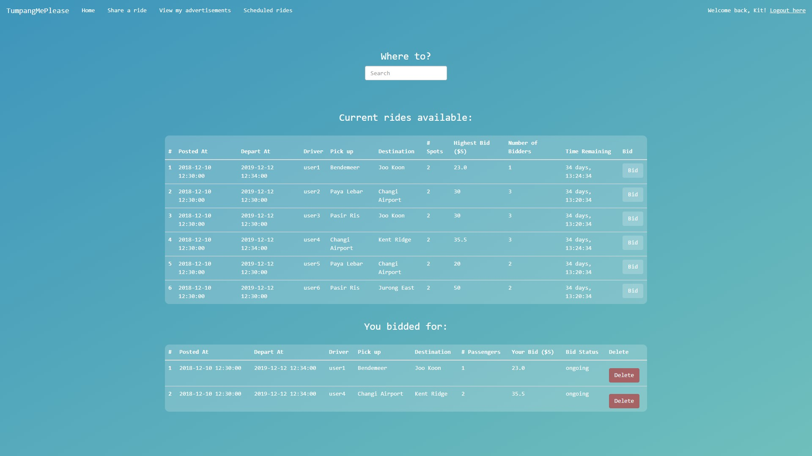
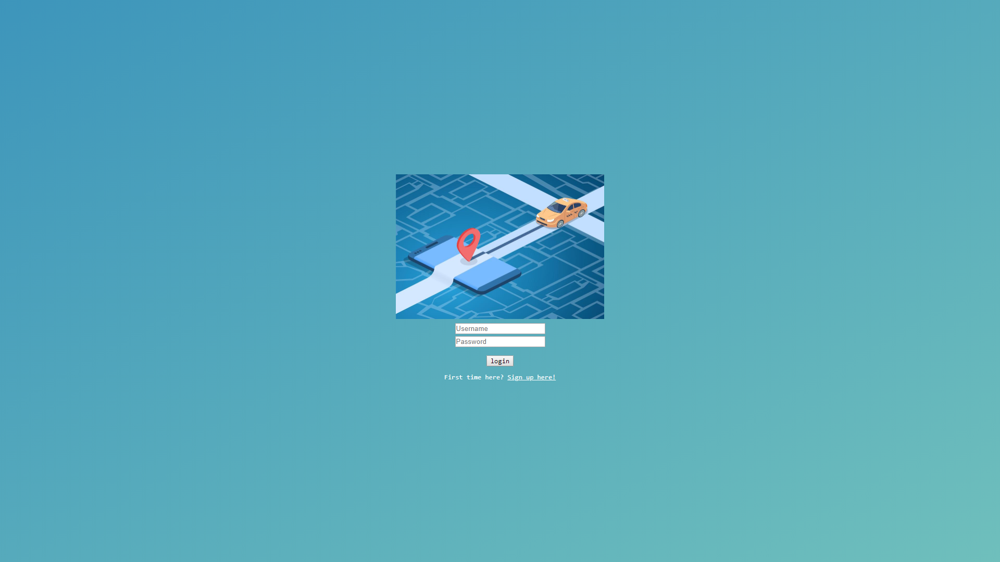
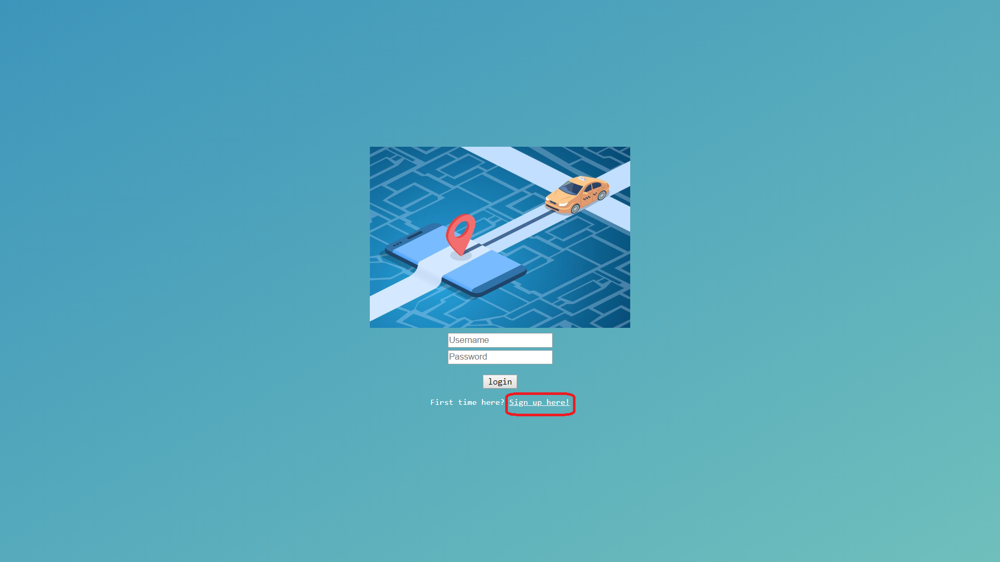
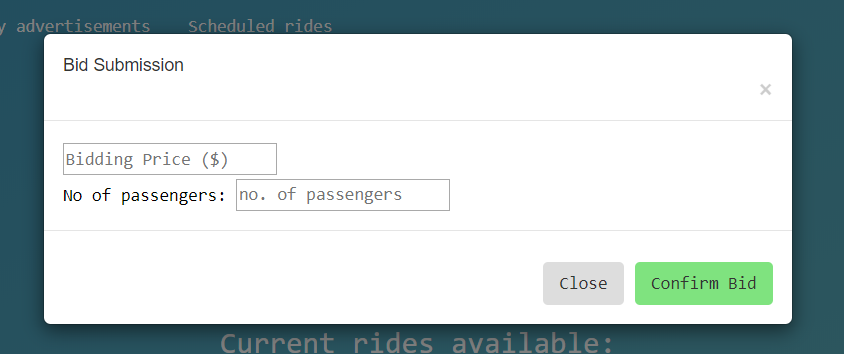
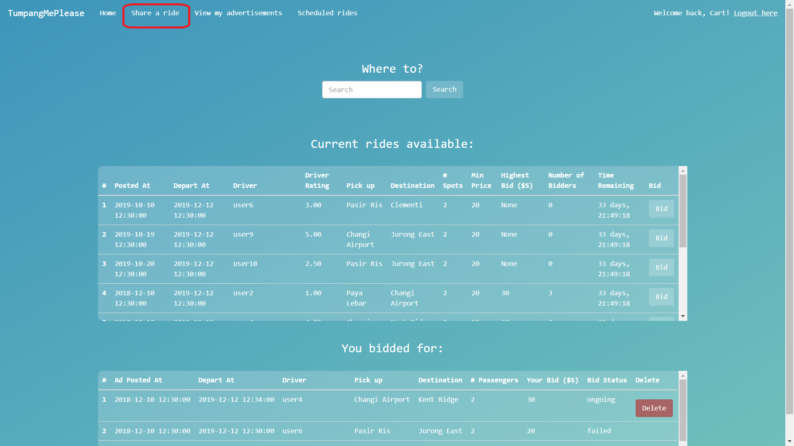

# Tumpang Me Please! 



# Pre-requisites
Ensure that you have the following installed:
1. PostgreSQL
2. Python 3.5 (and above)
3. Google Chrome (other browsers may not be supported)

# Setup Guide

1. Clone the files from its github repo [here](https://github.com/DriverUncle/TumpangMePlease.git). Clone the repo to your desired directory.
2. Open a terminal, set the directory to the cloned repo, then run the following command to install the dependencies: 
   -  for pip: `pip install -r requirements.txt`
   -  for conda: `conda install --file requirements.txt`
3. In the terminal,  launch PostgreSQL, and load the data from `/init.sql` into the database.
4. In the file `FlaskApp/app.py`, ensure that the login details match the existing ones in your PostgreSQL.
```python
# Config
app.config['SQLALCHEMY_DATABASE_URI'] = 'postgresql://{username}:{password}@{host}:{port}/{database}'\
    .format(
        username='postgres', # Your PostgreSQL username here
        password='password', # Your Password here
        host='localhost',
        port=5432,
        database='postgres'
    )
app.config['SECRET_KEY'] = 'A random key to use CRF for forms'
```

> **Note:** Replace `<username>`, `<password>`, `<port>`, and `<database_name>` with  the actual configuration from your database.
> If you are not sure about `<port>` and don't recall changing such a value during initial setup or launching of PostgreSQL server, then it should be `5432` by default.

5. In the terminal, set the directory to the cloned repo, then run the following command to start the development server: `python FlaskApp/app.py`
6. In chrome, type the following address `http://localhost:5000/` to launch the app. <br>You should see some messages showing up in your terminal, with these last few lines:
```
 * Debugger is active!
 * Debugger PIN: 215-554-995
 * Running on http://localhost:5000/ (Press CTRL+C to quit)
```

There may be warnings for SQLAlchemy but you can ignore those.

Go back to `app.py` file and observe the following lines:

```
if __name__ == "__main__":
    app.run(
        debug=True,
        host='localhost',
        port=5000
    )
```

These few lines define the host and port to run the web server.
If you change the port number to `5001`, the message shown at earlier stage will be changed accordingly.
For this walk-through (and also the CS2102 project), there is no need to change these settings.

To access the web server, open your favorite web browser (Chrome, Firefox, IE, etc) and enter `localhost:5000/` in the address bar.

Press `Enter` then the page below should show up.




Notice that `localhost:5000` comes from `app.py` setting, and the extra `/` comes from the URL routing mapping in `views.py`.
To add more web pages, you need to add routing to the new page in `views.py` and provide a function that renders the page to show when the URL is accessed.
Most likely you will need to show or render `html` files as web pages. To do that, you need to firstly drop the `html` file(s) into the `FlaskApp/templates` folder. 

# Registering and Logging into the app

## Registering as a new user
To register as a new user, follow these steps below:
1. Click on the circled button below


2. You will arrive at the registration page. Enter your personal details (first name, last name and your phone number), your username and password to be used for logging into the app.

3. Click on register. You should be able to log into the app now.

## Logging into the app
You need to log in to be able to use the app.

## Making a new bid
1. Select an ad where you wish to make a bid, and click on the `bid` button at the last column.
2. Enter the amount that you wish to bid, then `confirm bid`:


## Creating a new ad
> **Note:** You need to register a car in order to create a new advertisement (and other driver-related features). If you are not a driver, you will be redirected to the car registration page where you will need to register a car.

In order to create a new advertisement, perform the following steps:
1. Click on `Share a ride`

2. Fill in the details for the new advertisement. Once done, click on `Create Advertisement`.
